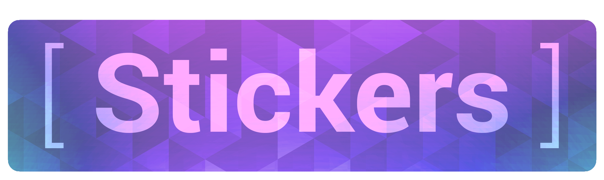

[](https://github.com/mikemackintosh/stickers/actions)

<p align="center">
  
</p>

---
Stickers is a Gmail label and filtering tool for your Google Workspaces org. It is designed to allow administrators to use filters and labels to classify emails, instead of clunky email message banners and difficult to read subject line headings.

This solution connects throught

## Getting Started
To get started, create your service account credentials by following Google's instructions, https://developers.google.com/admin-sdk/directory/v1/guides/delegation#create_the_service_account_and_credentials.

When asked for which scopes, enter the following for a least-permissive approach:
- https://www.googleapis.com/auth/admin.directory.user.readonly
- https://www.googleapis.com/auth/gmail.settings.basic
- https://www.googleapis.com/auth/gmail.labels

Once your domain is configured, you can then run the script.

## Installation
To install, run:

    make install

You may also build directly with go using:

    go build ./cmd/cli/...

## Running Stickers
To run, create a `stickers.yaml` configuration file. You can use an [example](./stickers.yaml-example), or use the below snippet to bootstrap your configuration. Once ready, you can run the following command, referencing your previously created service account credentials file from Google Cloud Platform.

```bash
$ stickers -c service-account.json
```

### Example:
```yaml
domain: mikemackintosh.com
impersonate: admin@mikemackintosh.com

labels:
  - name: '[External]'
    color:
      backgroundcolor: '#f691b2'
      textcolor: '#994a64'

  - name: '[Retain]'
    color:
      backgroundcolor: '#e07798'
      textcolor: '#ffffff'

filters:
  - label: '[External]'
    query:
      not_from:
        - mikemackintosh.com
        - no-reply@accounts.google.com
```
